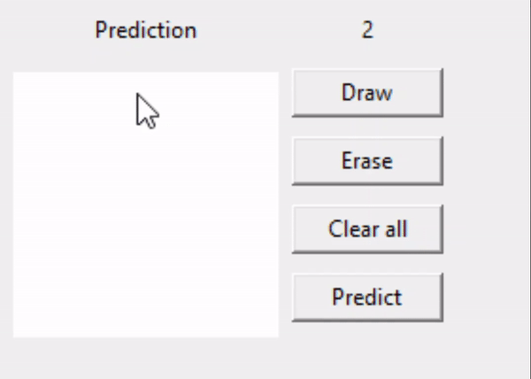

# Handwritten Digit Recognition with GUI

Using Multi-Layer Perceptron Neural Network to recognize handwritten digits with GUI to draw a digit and it will predict the digit
## Demo


## Screenshots


## Install and Run

Clone the project

```bash
  git clone https://github.com/husseinshaltout/GUI-Digit-Recognition.git
```

Go to the project directory

```bash
  cd GUI-Digit-Recognition
```
## Create virtual environment
```
python -m venv <env_name>
```
## Activate virtual environment
- ### Mac/Linux
    ``` bash
    source ./venv/bin/activate
    ```
- ### Windows
    ``` bash
    venv\Scripts\activate.bat
    ```
    You may need to add full path (c:\users\....venv\Scripts\activate.bat)

## Install requirements

```bash
pip install -r requirements.txt
```

## Run app

```bash
python main.py
```

## License

[MIT](https://choosealicense.com/licenses/mit/)

